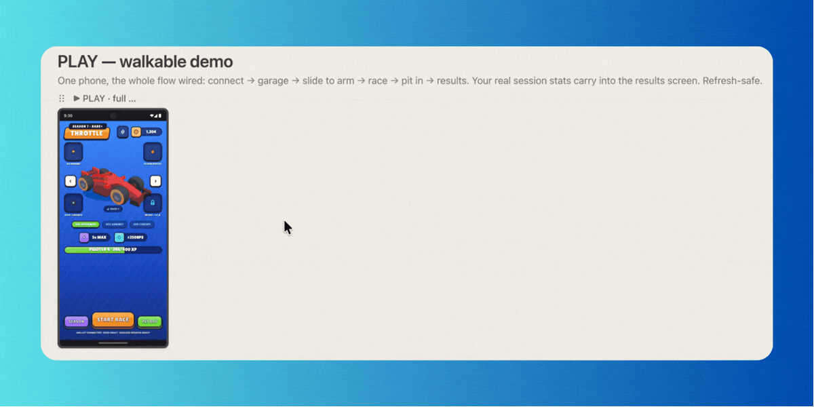
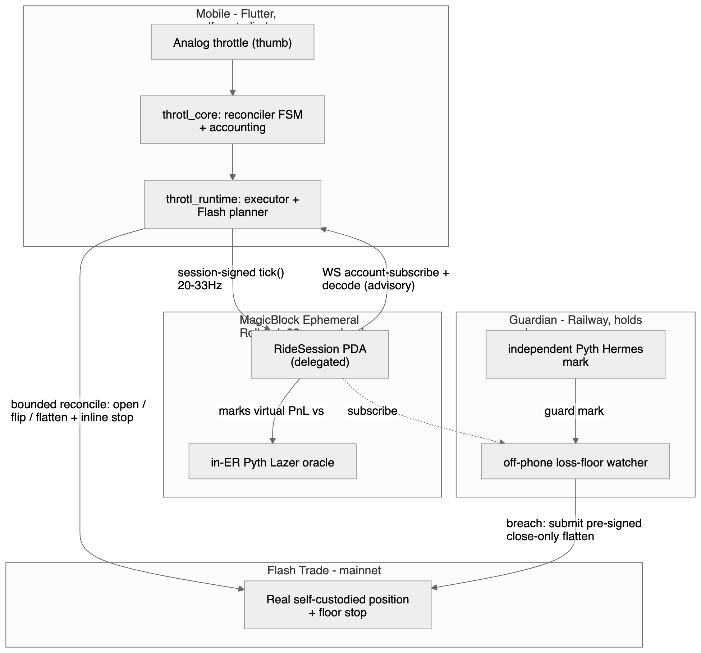
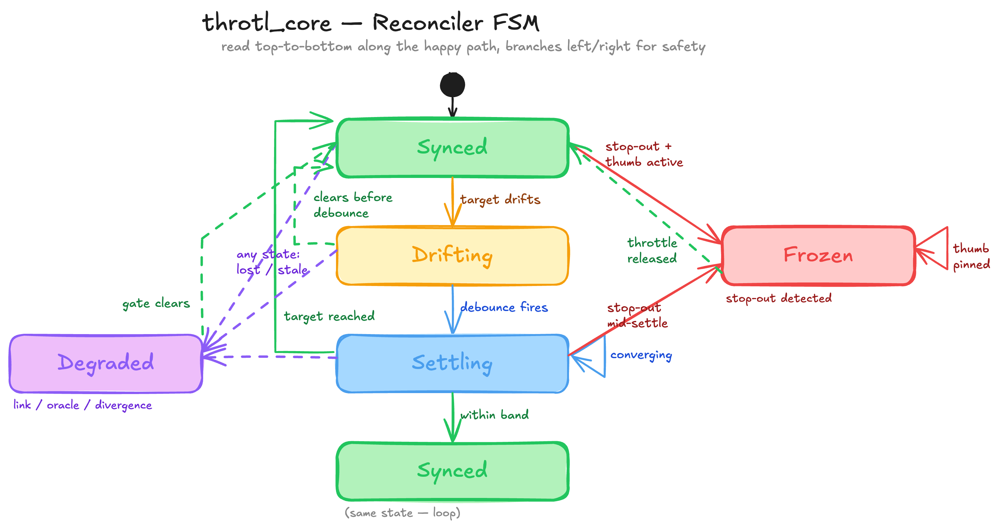
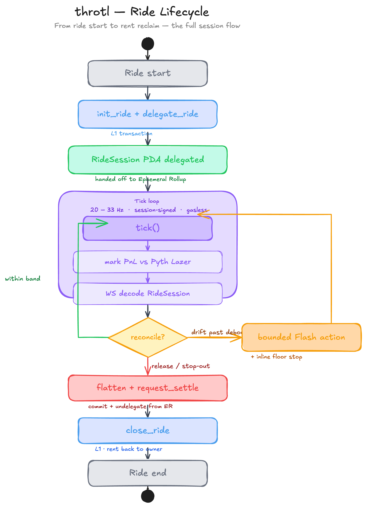
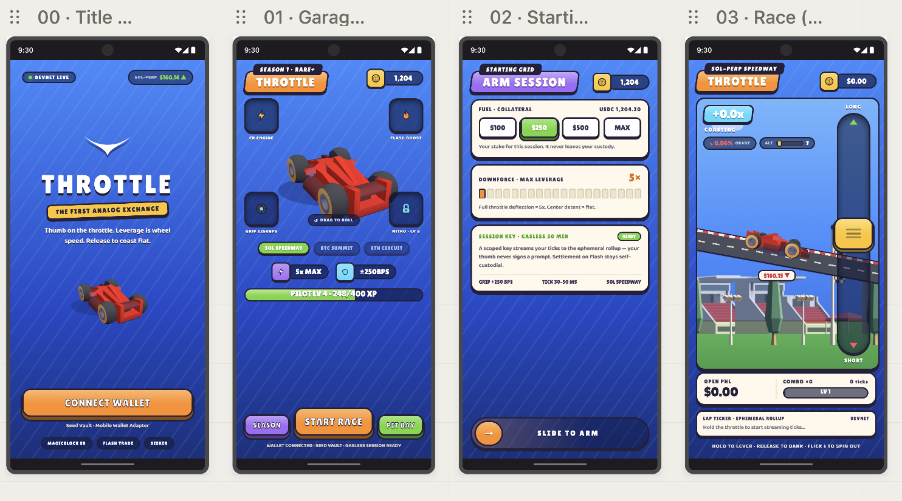
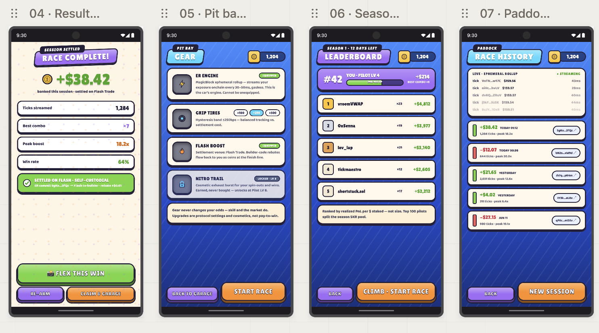
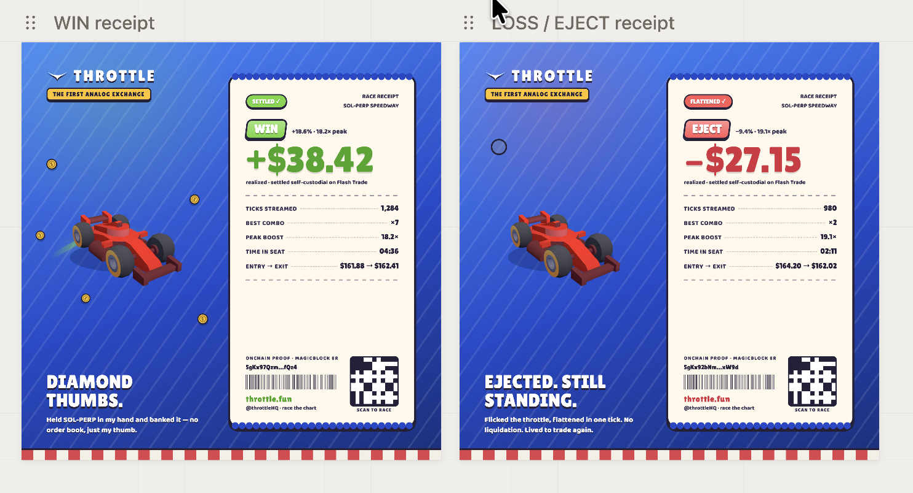

<div align="center">

# Throtl

**The first analog exchange.** Hold the market in your hand.

[throtl.fun](https://throtl.fun) · Solana mainnet + devnet



### [▶&nbsp; Watch the demo](https://youtu.be/9TNQ2p8RQZk) &nbsp;·&nbsp; [⬇&nbsp; Download the Android APK](https://github.com/Immadominion/Trotl/releases/latest/download/throtl-hackathon-build.apk)

</div>

> **Try it in 60 seconds.** Grab the [APK](https://github.com/Immadominion/Trotl/releases/latest/download/throtl-hackathon-build.apk) on any Android phone (enable *“install unknown apps”* when prompted), open Throtl, and connect **Seed Vault / Solflare / Phantom** via Mobile Wallet Adapter. Practice mode needs no wallet — you ride the **live** SOL-perp price immediately; flip "go live" to trade real, self-custodied Flash positions. Prefer to watch first? The [demo video](https://youtu.be/9TNQ2p8RQZk) walks a full ride end-to-end.

Throtl turns a perp trade into a thumb on a throttle. Your live exposure follows your finger at
~30 ms on a **MagicBlock Ephemeral Rollup**, mirrors into **real, self-custodied Flash Trade**
positions, and is watched off-phone by a **keyless guardian**. The metaphor *is* the product —
you race the chart, and the trade is real.

## Live on-chain

| | |
|---|---|
| **Program** | `YSaqfuc753DkHZoaEvdNMSTQTf4hEuTtP65hszuvJy9` — live on **mainnet-beta** + **devnet**, same id |
| **Build** | 72 KB zero-dependency [Pinocchio](https://github.com/anza-xyz/pinocchio) program · ~0.50 SOL rent · on-chain bytes **sha256-verified == audited local binary** |
| **Guardian** | keyless loss-floor watcher, live on Railway |
| **Ride** | full lifecycle proven end-to-end: program → ER → oracle → WS → reconciler → Flash |

## How it works



Two domains bridged by a bounded reconciler:

- **Ephemeral Rollup** holds *advisory* virtual exposure — gasless, session-signed ticks marked against an in-ER Pyth Lazer oracle.
- **Reconciler** mirrors that into *real* Flash positions under hard local bounds (`fuel × leverage`, an independent Pyth cross-check, a per-action cap) — always with a floor-derived stop.
- **Guardian** watches the loss floor off-phone and holds no keys — it can only submit your own pre-signed flatten.
- **The chain can never directly authorize a trade.** ER state is advisory; real money stays bounded and self-custodied.

| Reconciler FSM | Ride lifecycle |
|---|---|
|  |  |

## The cockpit

A chunky cartoon racing game where you **race the chart**: the throttle is signed exposure, road
pitch is momentum, coins and smoke are winning and losing ticks. Practice mode runs the *real*
reconciler against live prices; the real-money path is wired and gated behind an explicit "go live".




Every ride settles into a shareable receipt:



## Repo

```text
programs/
  throtl-engine-pin/   deployed program — zero-dep Pinocchio, RideSession PDA on a MagicBlock ER   [Rust]
  throtl-engine/       original Anchor build (reference)
app/                   Dart pub/melos workspace + Flutter cockpit (app/app)                        [Dart/Flutter]
  packages/            throtl_core (reconciler/accounting) · throtl_chain · magicblock_client ·
                       flash_client · throtl_runtime · throtl_live
services/guardian/     off-phone loss-floor watcher + game APIs (Railway) — holds no keys           [TS]
docs/                  architecture · product · roadmap · diagrams
```

## Build & test

```bash
# On-chain program (host tests + SBF build + litesvm adversarial suite — 40 tests)
cd programs/throtl-engine-pin && cargo test --lib && cargo build-sbf && cargo test

# Flutter cockpit
cd app/app && flutter run            # or: flutter run -d chrome  (web demo)

# Dart workspace + guardian
cd app && dart pub get && dart analyze packages
cd services/guardian && pnpm install && pnpm test
```

## Security

Audited before mainnet: one critical authorization gap found and fixed, proven by **22 adversarial
on-chain tests** that execute the attacks against the compiled program. The trust model is the
guarantee — the ER is advisory, real money is bounded by `fuel × leverage` + an independent price
cross-check + a real venue stop, and the guardian holds no keys.

## Docs

[Architecture](docs/ARCHITECTURE.md) · [Product](docs/PRODUCT.md) · [Roadmap](docs/ROADMAP.md) · [Diagrams](docs/diagrams/)

## License

MIT
